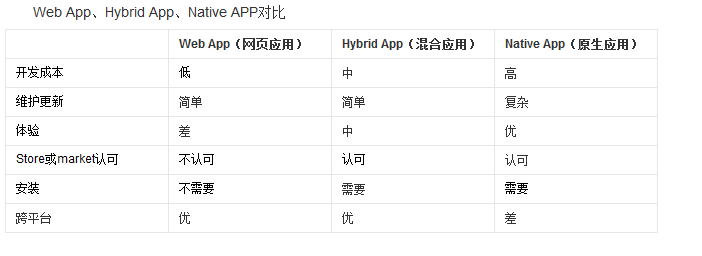
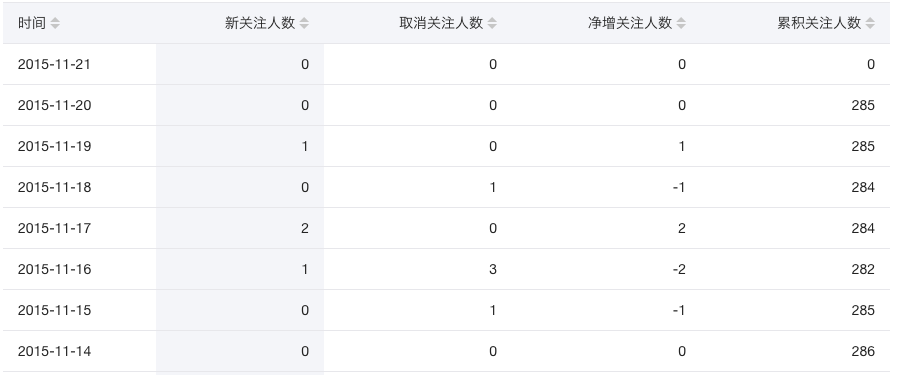

## 什么是混合移动App开发【重点】

1. 苹果上的软件是如何开发出来的：使用的是 OC、或者使用Swift这门语言
2. 安卓平台上的软件又是如何开发出来的：使用安卓相关的语言开发的，Java，安卓的控件进行开发
3. 苹果和安卓平台上共有的软件是如何开发出来的：腾讯招两套开发人员【开发组】，手机京东
4. 前端移动 App（Application）开发技术，去开发手机端的应用程序；
5. 前端的混合移动App开发技术，并没有使用 苹果 或 安卓 官方推荐的 开发平台和开发方式，而是抛弃了 官方提供的方式，使用 前端的独有的技术进行移动App开发体验；

> 什么是移动App开发：通俗的理解，就是把开发Web网站的技术（HTML+CSS+JS），通过某种方式，移植到移动App开发上进行使用，这种利用Web开发技术进行移动端开发体验的方式，叫做混合移动App开发！

### 关于移动App开发，需要知道的几个概念：

- 原生开发：它的英文单词是（NativeApp）,指的就是使用 IOS、Android 官方提供的工具、开发平台、配套语言进行 手机App开发的方式；

- 混合开发：（HybirdApp）就是使用前端已有的技术，HTML + CSS + JS ，然后再搭配一些相关的打包编译技术，就能够开发出一个手机App，安装到手机中进行使用；

- 什么是App：App是（Application的缩写），意思是：可安装的应用程序；

- App的分类：

  - 按照平台来划分：
    - PC端：浏览器、代码编辑器、PC端的游戏、听歌的、看视频的、聊天的
    - 移动端：手机QQ、手机微信、手机爱奇艺、亡者农药
  - 按照功能来划分：
    - 游戏：愤怒的小鸡仔、植物大战僵尸、亡者农药.....LOL
    - 应用：非游戏类的软件，支付宝、陌陌、美团外卖、

- App和Web的区别：

  - APP概念：App是（Application的缩写），意思是：可安装的应用程序；


  - 优点：流畅、稳定、基本上一些App都可以脱网运行，用户体验好；
  - 缺点：不能跨平台


  - Web概念：特指那些基于浏览器的web网站（本质：就是网页）


  - 优点：可以跨平台（浏览器天生就是跨平台的）
  - 缺点：没有App流畅、不稳定，受限于网速和网络

## 为什么要学混合App开发

### 从程序员的角度分析：

1. 挣钱多（别人不会的你会，别人会的，你精通）
2. 对于找工作来说：（React Native）市场需求量大，好找工作，提高我们的行业竞争力
3. 能接触到前端流行的技术和框架（各大公司基本都再用React），注意：再React中我们全部都使用ES6语法（class）

- 前端是一个永恒的行业???（只要世界上还有浏览器的存在，必然需要前端，只不过，随着时间的推移，技术更新换代，可能我们对新技术的要求会越来高）
- 屌丝的崛起之路：`只能做页面` -> `Ajax前后台数据交互` -> `Jquery、Bootstrap` -> webApp -> `三大框架` -> `可以做手机混合App/桌面应用` -> `可以做手机原生App` -> `将来或许可以发射火箭发射卫星发射导弹` -> `终极目标：统一全宇宙`

1. （搞前端App开发）能购置一批牛逼的设备【苹果笔记本、IOS测试机、安卓手机（三星的、华为、小米）】

### 从企业的角度分析:(选择合适自身的移动App开发方式)【重点】

- 节省开发成本


- 从工资上：尽最大的可能，压榨员工的剩余劳动力
- 从时间上：因为 原生的安卓和IOS开发，它们的开发效率并不是很高，因为原生的代码复杂度比较高，因此原生的开发周期比较慢；如果采用移动App开发，那么，我们的开发周期会很短；因为 HTML + CSS + JS 足够简单；（对于前端开发APP来说，有两种方式，其中，比较早的一种，也是比较简单的一种，就是 先开发出一个网站， 然后再把网站运行一行打包的命令，就能得到一个 APP了）

1. 市面上常见的App开发方式

- WebApp：基于浏览器实现的，有特定功能的网站，称作WebApp
  - 例如：百度脑图、https://m.jd.com/、https://m.taobao.com/#index
    - 优点：跨平台
    - 缺点：依赖网络，有白屏效果，相对来说，用户体验差；不能调用硬件底层得设备，比如摄像头；
- NativeApp：用android和Object-C等原生语言开发的应用
  - 优点：体验好；用户使用起来很流畅；非常适合做游戏【性能高】；可以直接调用硬件底层的API；
  - 缺点：不能跨平台
- HybirdApp：利用前端所学的知识去开发移动端App，兼具2者的优势
  - 优点：能够跨平台；体验会好一些；也能够调用硬件底层的API
  - 缺点：相对于原生体验稍微弱一丢丢；不适合做游戏；适合做非游戏类型的手机App；
  - 应用场景：
- 注意： 使用 Java 或者 IOS 写出来的代码和程序，在最终运行的时候，普通的文本代码，都会被编译为 原生的机器码去运行，并不像 JS 这样，解析执行，Java代码是 编译执行的；

1. 三种开发方式的原理和对比
   
   
2. [谁在使用React Native？？？](https://facebook.github.io/react-native/showcase.html)

## 企业如何选择合适自己的App开发方式

1. 如果这个企业中，曾经使用原生技术开发过一些APP，那么在维护的时候，必然需要使用原生技术来维护
2. 如果企业中，需要做一些游戏级别的应用，那么推荐使用原生，因为原生运行效率高，对耗电量处理的很好；
3. 如果企业做一些应用级别的非游戏软件，比如 淘宝、京东、美团，就可以使用 混合APP了；
4. 在企业中，最主要的是好的点子，如果有了一个好的项目立案，那么最好要立即把这个项目做出来；这时候，使用混合App非常合适，因为开发周期很短，能快速上线，抢先占领市场；【裤衩开发】

## 企业中项目开发流程

- 需求调研：产品定位、受众群体、市场需求、开发价值；【产出物：需求文档】
- 产品设计：功能模块、流程逻辑；【产出物：设计文档，交互稿】，确定项目的基本功能；
- 项目开发：项目架构、美工、前端、后台、测试【产品的把控】**要理解前后端分离的概念**
- 运营维护：上线试运行、调Bug、微调功能模块、产品迭代

> 根据需求搞设计，根据设计做开发

## 企业技术选型 - 几大主流技术之间的关系

1. Angular.js 和 Ionic

- [Angular1官网](https://angularjs.org/)
- [Angular2官网](https://angular.io/)
- [Ionic 中文网](http://www.ionic.wang/)
- [Ionic 英文官网](http://ionicframework.com/getting-started/)

1. Vue.js 和 Weex

- [Vue.js官网](https://cn.vuejs.org/)
- [Weex文档](http://weex.apache.org/cn/references/index.html)
- [Weex - github地址 - 新](https://github.com/apache/incubator-weex)
- [Weex - github地址 - 旧](https://github.com/alibaba/weex)

1. React.js 和 React-Native

- [React.js英文官网](https://facebook.github.io/react/)
- [ReactNative中文网](http://reactnative.cn/)
- [ReactNative英文网](http://facebook.github.io/react-native/)

> Angular, Vue, React 这三个都是前端框架，我们在进行混合App开发的时候，只是用到了这三个框架的【基础语法】而已；
> Ionic， Weex， ReactNatvie 这三个都是打包工具（提供了相关的命令行，只要运行指定的命令，就能够把项目打包成一个手机App出来），能够把我们开发出来的应用，最终打包成一个可安装的手机端程序安装包；同时，这三个东西，也提供了好用的一些小组件，方便我们去构建移动App的用户界面；

## 前端混合App开发框架

1. Html5+、ReactNative、Weex、Ionic
2. [认识HTML5+](http://www.html5plus.org/#home)

- h5+是一个产业联盟，它有一些互联网成员，专门在中国推广H5

1. [HBuilder官网](http://www.dcloud.io/)

## 开发框架之间的区别

####1、Html5+ 和 Ionic

~~~
- 1、首先要先做出来一个完整的网站
- 2、然后在网站的基础上，使用h5+或者Ionic提供的打包技术，
把网站打包成一个应用
在此期间：可以使用h5+或者Ionic提供的UI组件


为什么要打包？
- 1、为了能够安装到手机上
- 2、为了能够调用硬件底层设备api
在此期间：可以使用h5+或者Ionic提供的打包技术，方便的打包
应用，然后推送应用商店，就可以供用户下载使用了


打包以后就得到一个安卓应用，这个应用运行的其实就是一个
网站：
好处：开发效率高；
缺点：内部本质是一个网站，运行效率和性能不太好
~~~


####2、ReactNative 和 Weex

~~~
- 首先也需要开发出一个完整项目，只不过这里开发出来的就不是一个网站了，而是一个模版项目，不同于ionic和h5+;
- 注意：这里的模版项目，既不能运行到浏览器中，也不能运行到手机中，它只是一个半成品
- 注意：使用RN或者Weex提供组件，和语法，来搭建模版项目
- 注意：当项目开发完毕，再进行打包时，需要用到RN和Weex提供的打包命令行，把模版项目中的源代码，逐行翻译成原生的java或OC代码；最终，打包完毕，我们得到这个手机app内部我们所认识的代码，全部被转化成了原生的java代码，也就是：这种方式输出得到的，就是一个真正的原生性质APP；只不过使用前端技术开发出来的
- 注意使用RN或者Weex提供的打包技术，转换出一个原生性质的 手机app

- 打包完成后，得到一个原生性质的APP,它的运行性能，要高于WebAPP：
- 相比于H5+，这里得到的app性能好，使用流畅，因为内部不再是网站了；
- 缺点：可用的组件，没有H5+的多
~~~


## 使用HBuilder生成安卓应用（在线）

[API地址](http://www.html5plus.org/doc/zh_cn/webview.html)
Hbuilder这个工具，是一个在线打包工具，使用很方便，不需要在本地配置开发环境；直接将做好的网站，通过一些简单的操作，就能在线打包为一个App出来；

- 在项目上右键 -> 发行 -> 发行为原生安装包

好处：本地不用配置开发环境；操作方便，对于程序员来说不关心打包的过程，打包过程对于我们来说是透明的；
缺点：程序员很少能干预打包的过程；源代码被提交到了云端的服务器，存在项目核心代码被泄露的风险；

## 环境变量的使用

作用：将需要全局使用的工具或者应用程序，配置到Path环境变量中，可以很方便的通过命令行的形式，在任何想要运行这些应用程序的地方，运行它们；

## 移动App开发环境配置【重点】

### 安装最新版本的java jdk

1. 修改环境变量，新增`JAVA_HOME`的系统环境变量，值为`C:\Program Files (x86)\Java\jdk1.8.0_112`，也就是安装JDK的根目录
2. 修改系统环境变量`Path`，在`Path`之后新增`%JAVA_HOME%\bin;%JAVA_HOME%\jre\bin;`
3. 新建**系统环境变量**`CLASSPATH`，值为`.;%JAVA_HOME%\lib\dt.jar;%JAVA_HOME%\lib\tools.jar;`
4. 保存所有的系统环境变量，同时退出系统环境变量配置窗口，然后运行cmd命令行工具，输入`javac`，如果能出现javac的命令选项，就表示配置成功！

### 安装Node.js环境

注意：需要安装最新的长期稳定版本，不要实验版本；安装完毕之后的node.js会自动配置到全局系统环境变量中
安装完毕后，可以输入`node -v`查看node版本号；

### 安装C++环境

大多数情况下操作系统自带C\++环境，不需要手动安装C\++环境；
如果运行报错，则需要手动安装visual studio中的C\++环境；

### 安装Git环境

Git安装完毕后，会自动配置到系统环境变量中；
可以通过运行`git --version`来检查是否正确安装和配置了Git的环境变量；

### 安装Python环境

1. 注意：安装Python时候，只能**安装2.×的版本**，注意勾选安装界面上的`Add Python to path`，这样才能自动将Python安装到系统环境变量中；
2. 安装完毕之后，可以在命令行中运行`python`，检查是否成功安装了python。

### 配置安卓环境

1. 安装`installer_r24.3.4-windows.exe`，最好手动选择安装到C盘下的android目录
2. 打开安装的目录，将`android-25`、`android-23`(react-native必须依赖这个)解压后，放到`platforms`文件夹下
3. 解压`platform-tools`，放到`platform-tools`文件夹下
4. 【这一步直接忽略即可！】**tools文件夹不解压覆盖也行；**~~解压`tools`，放到安装根目录中~~
5. 解压`build-tools_r23.0.1-windows.zip(react-native必须依赖这个)`、`build-tools_r23.0.2-windows.zip(weex必须依赖这个)`和`build-tools_r23.0.3-windows.zip`，并将解压出来的文件夹，分别改名为版本号`23.0.1`、`23.0.2`和`23.0.3`；在安装目录中新建文件夹`build-tools`，并将改名为版本号之后的文件夹，放到新创建出来的`build-tools`文件夹下
6. 在安装目录中，新建`extras`文件夹，在`extras`文件夹下新建`android`文件夹；解压`m2responsitory`文件夹和`support`文件夹，放到新建的`extras -> android`文件夹下
7. 配置安装环境变量：在系统环境变量中新建`ANDROID_HOME`，值为android SDK Manager的安装路径`C:\Users\liulongbin\AppData\Local\Android\android-sdk`，紧接着，在Path中新增`;%ANDROID_HOME%\tools;%ANDROID_HOME%\platform-tools;`

## [ReactNative快速打包](http://reactnative.cn/docs/0.42/getting-started.html)

1. 安装完node后建议**设置npm镜像**以加速后面的过程（或使用科学上网工具）。注意：**不要使用cnpm！**cnpm安装的模块路径比较奇怪，packager不能正常识别！

> npm config set registry https://registry.npm.taobao.org --global<br/>
> npm config set disturl https://npm.taobao.org/dist --global

1. Yarn、React Native的命令行工具（react-native-cli）

- Yarn是Facebook提供的替代npm的工具，可以加速node模块的下载。React Native的命令行工具用于执行创建、初始化、更新项目、运行打包服务（packager）等任务。

  > npm install -g yarn react-native-cli

- 安装完yarn后同理也要设置镜像源：

  > yarn config set registry https://registry.npm.taobao.org --global<br/>
  > yarn config set disturl https://npm.taobao.org/dist --global

1. 运行`react-native init AwesomeProject`创建React-Native项目

2. 运行`cd AwesomeProject`切换到项目根目录中，运行`adb devices`来确保有设备连接到了电脑上

   ```
   一般安装了Hbuilder的都会有adb，将它的绝对路径配置到path环境变量即可
   ```

   ​

3. 运行`react-native run-android`打包编译安卓项目，并部署到模拟器或开发机中

   ```
    unable to load script from asset/index.android.bundle问题解决：
    原因：assets中没有成功打包出index.android.bundle文件
   　　解决：1.去（你的项目文件夹）\android\app\src\main目录下新建asset文件夹
   　　　　　2.终端下运行
   　　　　　react-native bundle --platform android --dev false --entry-file index.android.js --bundle-output android/app/src/main/assets/index.android.bundle --assets-dest android/app/src/main/res
   　　　　　3.再次执行 react-native run-android
   注：由于0.49版本以后的react-native没有index.android.js和index.ios.js文件，而统一合并成了index.js，所以使用0.49及以后版本的同学请将第2步中的入口文件改为index.js
   		 react-native bundle --platform android --dev false --entry-file index.js --bundle-output android/app/src/main/assets/index.android.bundle --assets-dest android/app/src/main/res

   附上解决方式原贴：https://stackoverflow.com/questions/44446523/unable-to-load-script-from-assets-index-android-bundle-on-windows
   ```

   ​

   ​

4. 运行上一条命令之前，要确保有设备连接到了电脑上，可以运行`adb devices`查看当前接入的设备列表，打包好的文件，放到了`android\app\build\outputs\apk`目录下

5. [入坑指南](http://www.open-open.com/lib/view/open1477469117948.html)

> **问题1：开启悬浮框权限；**<br/>
> **问题2：Could not get BatchedBridge, make sure your bundle is packaged correctly**<br/>
> 解决方案：在终端中，进入到项目的根目录，执行下面这段命令行：<br/>
> `react-native bundle --platform android --dev false --entry-file index.android.js --bundle-output android/app/src/main/assets/index.android.bundle --assets-dest android/app/src/main/res/`<br/>
> 运行之前，需要确保`android/app/src/main/`目录下有`assets`文件夹，如果没有，手动创建之~，再运行上面的命令；<br/>
> **问题3：could not connect to development server**<br/>
> 解决方案：晃动手机，唤起设置属性窗口，点击“Dev settings”，再点击Debuug server host 出现设置ip地址窗口，填写Ip地址和端口号8081，例如`192.168.1.111:8081`

## [Weex快速打包](http://weex.apache.org/cn/guide/tools/toolkit.html)

1. 安装依赖:Weex 官方提供了 weex-toolkit 的脚手架工具来辅助开发和调试。首先，你需要最新稳定版的 Node.js 和 Weex CLi。

2. 运行`npm install -g weex-toolkit`安装Weex 官方提供的 `weex-toolkit` 脚手架工具到全局环境中

   ```
   使用npm4 才支持
   npm install npm@4 -g
   ```

   ​

3. 运行`weex create project-name`初始化Weex项目

4. 进入到项目的根目录中，打开cmd窗口，运行`weex platform add android`安装android模板，首次安装模板时，等待时间较长，建议fq安装模板

5. 打开`android studio`中的`安卓模拟器`，或者将`启用USB调试的真机`连接到电脑上，运行`weex run android`，打包部署weex项目

6. 部署完成，查看项目效果

没有自动更新

## 总结重点

1. 什么是前端移动App开发

   ​	就是把开发Web网站的技术（HTML+CSS+JS），通过某种方式，移植到移动App开发上进行使用，这种利用Web开发技术进行移动端开发体验的方式，叫做混合移动App开发！

2. 市面上常见的App开发方式及优缺点

   ~~~
   WebApp：基于浏览器实现的，有特定功能的网站，称作WebApp
   - 优点：跨平台
   - 缺点：依赖网络，有白屏效果，相对来说，用户体验差；不能调用硬件底层得设备，比如摄像头；
   NativeApp：用android和Object-C等原生语言开发的应用
   - 优点：体验好；用户使用起来很流畅；非常适合做游戏【性能高】；可以直接调用硬件底层的API；
   - 缺点：不能跨平台
   HybirdApp：利用前端所学的知识去开发移动端App，兼具2者的优势
   - 优点：能够跨平台；体验会好一些；也能够调用硬件底层的API
   - 缺点：相对于原生体验稍微弱一丢丢；不适合做游戏；适合做非游戏类型的手机App；
   ~~~

   

3. 使用Hbuilder在线生成安卓应用

4. 学会配置ReactNative开发环境

5. 掌握ReactNative打包流程

   - 1、react-native init AwesomeProject创建React-Native项目
   - 2、运行cd AwesomeProject切换到项目根目录中，
   - 3、运行adb devices来检测有设备连接到了电脑上
   - 4、运行react-native run-android打包编译安卓项目，并部署到模拟器或开发机中
   - 5、打包好的文件，放到了android\app\build\outputs\apk目录下


## webpack的发布策略

1. 在实际开发中，一般会有两套项目方案：

- 一套是开发期间的项目

  包含了测试文件、测试数据、开发工具、测试工具等相关配置有利于项目的开发和测试，但是这些文件仅用于开发，发布项目时候需要剔除；

- 另一套是部署期间的项目

  剔除了那些客户用不到的测试数据测试工具和文件，比较纯净，减少了项目发布后的体积，有利于安装和部署！

###开发阶段：

~~~
1、创建一个项目文件夹：
新建基本目录及文件：
- 复习：
- src 
-- index.html
-- mian.js
- dist
- webpack.config.js

2、安装jquery
yarn add jquery//默认-S
webpack 安装 3.8.1
在项目入口文件中导入：
// 发布思路： bundle.js 中只存放 自己的代码， 第三方包的代码，全部抽离到 另外的JS中
import $ from 'jquery'

$(function () {
  $('li:odd').css('backgroundColor', 'pink')
  $('li:even').css('backgroundColor', 'lightblue')
})

3、配置打包命令（webpack.config.js）：
const path = require('path')
const htmlWebpackPlugin = require('html-webpack-plugin')

module.exports = {
  entry: path.join(__dirname, './src/main.js'),
  output: {
    path: path.join(__dirname, './dist'),
    filename: 'bundle.js'
  }
 }
 
 直接运行webpack 即可打包！
 
 4、实时代码更新，内存自动生成：
- 首先安装包：
yarn add webpack --dev
yarn add webpack-dev-server html-webpack-plugin --dev
webpack.config.js中引入：
const htmlWebpackPlugin = require('html-webpack-plugin')
- 加入plugin数组插件节点：
 plugins: [
	new htmlWebpackPlugin({
	   //生成页面
	   template: path.join(__dirname,'./src/index.html'),
	   filename: 'index.html'
	})
 ]
 
 - package.json文件中，script属性下新增”dev“:
"dev": "webpack-dev-server --open --port 3000 --hot",

5、 打包样式文件以及css文件
main.js中导入样式：
import './css/index.scss'
- 先安装解析样式文件的第三方包：
yarn add style-loader css-loader --dev
yarn add url-loader file-loader --dev
- 这个单独运行： yarn add sass-loader@6.0.6 node-sass@4.6.0 --dev

- webpack.config.js中新增 module属性：
rules: [
      { test: /\.css$/, use: ['style-loader', 'css-loader'] },
      { test: /\.scss$/, use: ['style-loader', 'css-loader', 'sass-loader'] },
      { test: /\.(png|gif|bmp|jpg)$/, use: 'url-loader?limit=5000' },
    ]
    
6、js高级语法：
安装：
yarn add babel-core babel-loader babel-plugin-transform-runtime babel-preset-env babel-preset-stage-0 --dev
配置解析规则： { test: /\.js$/, use: 'babel-loader', exclude: /node_modules/ }

7、新建.babelrc文件:
{
  "presets": ["env", "stage-0"],
  "plugins": ["transform-runtime"]
}
~~~


###部署发布阶段：

1. 为了满足我们的发布策略，需要新建一个配置文件，命名为`webpack.publish.config.js`，将`webpack.config.js`的配置拷贝过去，剔除一些开发配置项即可：

~~~
优化：
-1、 复制webpack.config.js
-2、 新建webpack.pub.config.js:
	粘贴进去
-3、package.json新增"pub":"webpack --config webpack.pub.config.js"
- 执行npm run pub//执行发布版本
注意： 先通过webpack命令查看生成照片
       再通过npm run pub 查看是否生成8为hash值的照片
       配置图片时，设置limit值才能看到效果

继续优化：
- 配置图片打包后统一存放在images中
{ test: /\.(png|gif|bmp|jpg)$/, use: 'url-loader?limit=500&name=images/[hash:8]-[name].[ext]' },
- 原理：通过传参指定生成路径

~~~

- 将`devServer`节点删掉：

```
 devServer: {
        hot: true,
        open: true,
        port: 4321
    }
```

- 将`plugins`节点下的热更新插件删掉：

```
 new webpack.HotModuleReplacementPlugin()
```

1. 修改`url-loader`，将图片放入统一的images文件夹之下：

```
{ test: /\.(png|jpg|gif)$/, use: 'url-loader?limit=43959&name=images/[name].[ext]' }
```

或者使用`img-`前缀加上`7位的hash名称`：

```
{ test: /\.(png|jpg|gif)$/, use: 'url-loader?limit=43959&name=images/img-[hash:7].[ext]' }
```

1. 在`package.json`中的script节点下新增`dev`命令，通过`--config`指定webpack启动时要读取的配置文件：

```
"pub": "webpack --config webpack.publish.config.js"
```

## 每次重新构建时候删除dist目录

1. 运行`cnpm i clean-webpack-plugin --save-dev`

   或者yarn add clear-webpack-plugin --dev

2. webpack.pub.config.js文件在头部引入这个插件：

```
const clearWebpackPlugin = require('clear-webpack-plugin')
```

1. 在`plugins`节点下使用这个插件：

```
new cleanWebpackPlugin(['dist'])//这样每次生成的dist都是最新的，因为旧的已经被删除
```

## 分离第三方包改造`webpack.publish.config.js`

​	比如 main.js 引入的jquery/vue/vue-router第三包，放到单独文件中去

~~~
- webpack.pub.config.js:导入webpack
- cosnt webpack = require('webpack')
~~~

1. 改造entry节点如下：

```
entry: {
        app: path.resolve(__dirname, 'src/js/main.js'), // 自己代码的入口
        vendors: ['jquery'] // 要分离的第三方包的入口
    }
```

1. 在plugins节点下新增插件：

```
new webpack.optimize.CommonsChunkPlugin({ // 抽离第三方包的插件
        name:'vendors', // 指定抽离第三方包的入口名称
        filename:'vendors.js' // 抽离出的公共模块的名称
})
```

1. `html-webpack-plugin`在生成`index.html`文件的时候，会自动将抽离的第三方包引入进去！

- 执行： npm run pub
- 优化将js文件统一放到js文件夹下：

  修改filname属性：filename: 'js/bundle.js'

## [优化压缩JS](https://webpack.js.org/configuration/plugins/#plugins)

在plugins数组中添加：

```
new webpack.optimize.UglifyJsPlugin({ // 优化压缩JS
    compress:{
        warnings:false // 移除警告
    }
}),
new webpack.DefinePlugin({ // 设置为产品上线环境，进一步压缩JS代码
    'process.env.NODE_ENV': '"production"'
})
```

## 优化压缩HTML文件

在`plugins`节点下的`htmlWebpackPlugin`插件中，添加`minify`子节点：

```
minify:{// 压缩HTML代码
    collapseWhitespace:true, // 合并空白字符
    removeComments:true, // 移除注释
    removeAttributeQuotes:true // 移除属性上的引号
}
```

其他优化项请参考：[html-minifier - github](https://github.com/kangax/html-minifier#options-quick-reference)

## [抽取CSS文件](https://github.com/webpack-contrib/extract-text-webpack-plugin)

1. 运行`npm install --save-dev extract-text-webpack-plugin`安装抽取CSS文件的插件。
2. 在配置文件中导入插件：

```
const ExtractTextPlugin = require("extract-text-webpack-plugin");
```

1. 修改CSS和Sass的loader如下：

```
{
    test: /\.css$/, use: ExtractTextPlugin.extract({
        fallback: "style-loader",
        use: ["css-loader"],
        publicPath: '../' // 设置图片路径
    })
},
{
    test: /\.scss$/, use: ExtractTextPlugin.extract({
        fallback: "style-loader",
        use: ['css-loader', 'sass-loader'],
        publicPath: '../' // 设置图片路径
    })
}
```

1. 在plugins节点下新增插件：

```
new ExtractTextPlugin("css/styles.css"), // 抽取CSS文件的插件
```

## [压缩抽取出来的CSS文件](https://github.com/NMFR/optimize-css-assets-webpack-plugin)

1. 运行`cnpm i optimize-css-assets-webpack-plugin --save-dev`安装插件到开发依赖。
   - 运行yarn add optimize-css-assets-webpack-plugin@3.2.0 --dev安装插件到开发依赖
2. 在配置文件头部导入插件：

```
var OptimizeCssAssetsPlugin = require('optimize-css-assets-webpack-plugin');
```

1. 在plugins节点下新增插件：

```
 new OptimizeCssAssetsPlugin() // 压缩CSS文件的插件
```

## 相关文章

1. [Sass 基础教程](http://www.sasschina.com/guide/)
2. [webpack-dev-server](https://github.com/webpack/webpack-dev-server/releases)
3. [You have not accepted the license agreements of the following ](http://majing.io/questions/804)


## ReactJS简介

- React 起源于 Facebook 的内部项目，因为该公司对市场上所有 JavaScript MVC 框架，都不满意，就决定自己写一套，用来架设 Instagram 的网站。做出来以后，发现这套东西很好用，**就在2013年5月开源了**。
- 由于 React 的设计思想极其独特，属于革命性创新，性能出众，代码逻辑却非常简单。所以，越来越多的人开始关注和使用，认为它可能是将来 Web 开发的主流工具。
- library
- Framework

## 前端三大主流框架

- Angular.js：出来最早的前端框架，学习曲线比较陡，NG1学起来比较麻烦，NG2开始，进行了一系列的改革，也开始启用组件化了；在NG中，也支持使用TS（TypeScript）进行编程；
- Vue.js：最火的一门前端框架，它是中国人开发的，对我我们来说，文档要友好一些；
- React.js：最流行的一门框架，因为它的设计很优秀；
- windowsPhone 7    7.5   8   10

## React与vue.js的对比

### 组件化方面

1. 什么是模块化：从 **代码** 的角度，去分析问题，把我们编程时候的业务逻辑，分割到不同的模块中来进行开发，这样能够**方便代码的重用**；
2. 什么是组件化：从 **UI** 的角度，去分析问题，把一个页面，拆分为一些互不相干的小组件，随着我们项目的开发，我们手里的组件会越来越多，最后，我们如果要实现一个页面，可能直接把现有的组件拿过来进行拼接，就能快速得到一个完整的页面， 这样方**便了UI元素的重用**；**组件是元素的集合体**；
3. 组件化的好处：
4. Vue是如何实现组件化的：.vue 组件模板文件，浏览器不识别这样的.vue文件，所以，在运行前，会把 .vue 预先编译成真正的组件；

- template： UI结构
- script： 业务逻辑和数据
- style： UI的样式

1. React如何实现组件化：在React中实现组件化的时候，根本没有 像 .vue 这样的模板文件，而是，直接使用JS代码的形式，去创建任何你想要的组件；

- React中的组件，都是直接在 js 文件中定义的；
- React的组件，并没有把一个组件 拆分为 三部分（结构、样式、业务逻辑），而是全部使用JS来实现一个组件的；（也就是说：结构、样式、业务逻辑是混合在JS里面一起编写出来的）

### 开发团队方面

- React是由FaceBook前端官方团队进行维护和更新的；因此，React的维护开发团队，技术实力比较雄厚；
- Vue：第一版，主要是有作者 尤雨溪 专门进行维护的，当 Vue更新到 2.x 版本后，也有了一个小团队进行相关的维护和开发；

### 社区方面

- 在社区方面，React由于诞生的较早，所以社区比较强大，一些常见的问题、坑、最优解决方案，文档、博客在社区中都是可以很方便就能找到的；
- Vue是近两年才诞生开源出来的，所以，它的社区相对于React来说，要小巧一些，所以，可能有的一些坑，没人踩过；

### 移动APP开发体验方面

- Vue，结合 Weex 这门技术，提供了 迁移到 移动端App开发的体验（Weex，目前只是一个 小的玩具， 并没有很成功的 大案例；）
- React，结合 ReactNative，也提供了无缝迁移到 移动App的开发体验（RN用的最多，也是最火最流行的）；

## 为什么要学习React

1. 设计很优秀，是基于组件化的，方便我们UI代码的重用；
2. 开发团队实力强悍，不必担心短更的情况；
3. 社区强大，很多问题都能找到对应的解决方案；
4. 提供了无缝转到 ReactNative 上的开发体验，让我们技术能力得到了拓展；增强了我们的核心竞争力

## React中几个核心的概念

### 虚拟DOM（Virtual Document Object Model）

- DOM的本质是什么：就是用JS表示的UI元素
- DOM和虚拟DOM的区别：
  - DOM是由浏览器中的JS提供功能，所以我们只能人为的使用 浏览器提供的固定的API来操作DOM对象；
  - 虚拟DOM：并不是由浏览器提供的，而是我们程序员手动模拟实现的，类似于浏览器中的DOM，但是有着本质的区别；


- 为什么要实现虚拟DOM：

   ~~~
   1、哪怕我们的数据发生了一点点变化也会被强制重建整颗DOM树
   这样就涉及了很多元素的重绘和重排，导致性能浪费严重。
   ~~~

- 什么是React中的虚拟DOM：

   ~~~
   使用js创建一个对象，用这个对象模拟我们的DOM节点，然后再每个DOM节点中，又提供children这样的属性，
   来描述当前DOM的子节点，这样当DOM节点形成了嵌套关系，就模拟出了一颗DOM树。
   ~~~

   

- 虚拟DOM的目的：为了实现DOM节点的高效更新。
   
   

### Diff算法

- tree diff: 新旧DOM树，逐层对比的方式，就叫做 tree diff,每当我们从前到后，把所有层的节点对比完后，必然能够找到那些 需要被更新的元素；
- component diff：在对比每一层的时候，组件之间的对比，叫做 component diff;当对比组件的时候，如果两个组件的类型相同，则暂时认为这个组件不需要被更新，如果组件的类型不同，则立即将旧组件移除，新建一个组件，替换到被移除的位置；
- element diff:在组件中，每个元素之间也要进行对比，那么，元素级别的对比，叫做 element diff；
- key：key这个属性，可以把 页面上的 DOM节点 和 虚拟DOM中的对象，做一层关联关系；


## React项目的创建

1. 运行 `cnpm i react react-dom -S` 安装包
2. 在项目中导入两个相关的包：

```
// 1. 在 React 学习中，需要安装 两个包 react  react-dom
// 1.1 react 这个包，是专门用来创建React组件、组件生命周期等这些东西的；
// 1.2 react-dom 里面主要封装了和 DOM 操作相关的包，比如，要把 组件渲染到页面上
import React from 'react'
import ReactDOM from 'react-dom'
```

1. 使用JS的创建虚拟DOM节点：

```
    // 2. 在 react 中，如要要创建 DOM 元素了，只能使用 React 提供的 JS API 来创建，不能【直接】像 Vue 中那样，手写 HTML 元素
    // React.createElement() 方法，用于创建 虚拟DOM 对象，它接收 3个及以上的参数
    // 参数1： 是个字符串类型的参数，表示要创建的元素类型
    // 参数2： 是一个属性对象，表示 创建的这个元素上，有哪些属性
    // 参数3： 从第三个参数的位置开始，后面可以放好多的虚拟DOM对象，这写参数，表示当前元素的子节点
    // <div title="this is a div" id="mydiv">这是一个div</div>

    var myH1 = React.createElement('h1', null, '这是一个大大的H1')

    var myDiv = React.createElement('div', { title: 'this is a div', id: 'mydiv' }, '这是一个div', myH1)
```

1. 使用 ReactDOM 把元素渲染到页面指定的容器中：

```
    // ReactDOM.render('要渲染的虚拟DOM元素', '要渲染到页面上的哪个位置中')
    // 注意： ReactDOM.render() 方法的第二个参数，和vue不一样，不接受 "#app" 这样的字符串，而是需要传递一个 原生的 DOM 对象
    ReactDOM.render(myDiv, document.getElementById('app'))
```

## JSX语法

~~~
由于React官方发现直接让用户手写js代码，创建元素，用户会疯掉，
于是，React官方就出了，一套jsx语法规法，能够让我们在js文件中书写类似HTML那样的代码，快速定义DOM结构，
问题：JSX的原理是什么？
- 符合 XML 规范的 JS 语法
- 千万要记住，哪怕在js中可以写jsx语法了，但是jsx内部运行时，也是要先把类似HTML这样的标签代码，转换为了React.createElment形式
- 就是说哪怕谢了 JSX 这样的标签也并不是直接把我们的HTML标签直接渲染到页面上而是先转换成React.createElment，再渲染到页面中
- JSX 是一个对程序友好的语法糖
~~~

1. 如要要使用 JSX 语法，必须先运行 `cnpm i babel-preset-react -D`，然后再 `.babelrc` 中添加 语法配置；

   ~~~
   presets:["react"]
   
   然后就可以直接使用了：
   var myDiv = <div>
   	这是一个 使用 JSX 语法的div
   	<h1>哈哈哈！</h1>
   </div>
   ~~~

   

2. JSX语法的本质：还是以 React.createElement 的形式来实现的，并没有直接把 用户写的 HTML代码，渲染到页面上；

3. 如果要在 JSX 语法内部，书写 JS 代码了，那么，所有的JS代码，必须写到 {} 内部；

4. 当 编译引擎，在编译JSX代码的时候，如果遇到了`<`那么就把它当作 HTML代码去编译，如果遇到了 `{}` 就把 花括号内部的代码当作 普通JS代码去编译；

5. 在{}内部，可以写任何符合JS规范的代码；

6. 在JSX中，如果要为元素添加`class`属性了，那么，必须写成`className`，因为 `class`在ES6中是一个关键字；和`class`类似，label标签的 `for` 属性需要替换为 `htmlFor`.

7. 在JSX创建DOM的时候，所有的节点，必须有唯一的根元素进行包裹；

8. 如果要写注释了，注释必须放到 {} 内部

## React中：第一种创建组件的方式

## 第一种基本组件的创建方式

```
// - 在React中 ，构造函数 就是一个最基本组件
// - 如果想要把组件放到页面中，可以把构造函数名称，当作 组件名称
// ，以HTML 标签形式引入页面中
// - 注意React解析所有标签时候，是以首字母来区分的，如果标签的
// 首字母是大写，则 按照 组件形式去渲染
function Hello(props) {
  return <div>
    {/*<p>React通过构造函数创建的组件---{name}</p>*/}
    <p>React通过构造函数创建的组件---name:{props.name}---age:{props.age}</p>
  </div>
}

ReactDOM.render(
  // <Hello name={name}></Hello>
  <Hello></Hello>
,document.getElementById('app'))
```

- 父组件向子组件传递数据

  ```
  <Hello name={name}></Hello>
  ```

- 属性扩散

  ```
  ReactDOM.render(
    // <Hello name={name}></Hello>
    <Hello {...person}></Hello>
  ,document.getElementById('app'))
  ```

- 将组件封装到单独的文件中

## React中：第二种创建组件的方式

### 了解ES6中class关键字的使用

### 基于class关键字创建组件

- 使用 class 关键字来创建组件

```
class Person extends React.Component{
    // 通过报错提示得知：在class创建的组件中，必须定义一个render函数
    render(){
        // 在render函数中，必须返回一个null或者符合规范的虚拟DOM元素
        return <div>
            <h1>这是用 class 关键字创建的组件！</h1>
        </div>;
    }
}
```


## 两种创建组件方式的对比

1. 用构造函数创建出来的组件：专业的名字叫做“无状态组件”
2. 用class关键字创建出来的组件：专业的名字叫做“有状态组件”

~~~
这两种不同的组件之间的本质区别就是：有无state属性！！！
即：this.state

无状态的函数创建的组件是无状态组件，它是一种只负责展示的纯组件
有状态的组件，这些组件是要被实例化的，并且可以访问组件的生命周期方法。
~~~

####有状态组件和无状态组件区别？

- 是否有自己的state数据私有数据
- 使用class关键字创建的组件，内部出了有this.props只读属性以为，还有专门存放自己数据的state属性。
- 基于上面的区别，我们可以为这两种创建组件的方式，下定义，使用function创建的叫无状态组件，使用class叫有状态组件，
- 有状态组件和无状态组件最本质区别是有无state，class有自己的生命周期函数function则没有自己生命周期函数

####什么时候用有状态？什么时候用无状态？

- 1、组件需要存自己的私有数据，需要在不同阶段执行不同的业务逻辑，非常适合用有状态组件。
- 2、组件只需要根据外接1传递过来的props渲染页面就行，那么时候适合fucntion创建的无状态组件。好处：由于剔除了组件生命周期，所以运行速度会快一点点


## 一个小案例，巩固有状态组件和无状态组件的使用

### 通过for循环生成多个组件

1. 数据：

```
this.state={
    CommentList:[
         { user: '张三', content: '哈哈，沙发' },
    	{ user: '张三2', content: '哈哈，板凳' },
   	 	{ user: '张三3', content: '哈哈，凉席' },
    	{ user: '张三4', content: '哈哈，砖头' },
    	{ user: '张三5', content: '哈哈，楼下山炮' }
    ]
}

- 我们可以直接在 JSX 语法内部，使用 数组的 map 函数，来遍历数组的每一项，并使用 map 返回操作后的最新的数组
this.state.CommentList.map(item = > {
	return <h1>{item.user}</h1>	
})

```


### React中使用style样式

外联样式：

~~~
- 引入：import itemStyles from '../../css/commentItem.css'
- 就必须启用css模块化：
- 当启用 CSS 模块化之后，导入 样式表得到的 itemStyles 就变成了一个 样式对象，其中，属性名是 在样式表中定义的类名，属性值，是自动生成的一个复杂的类名（防止类名冲突）
- 启用css样式模块化
{ test: /\.css$/, use: ['style-loader', 'css-loader?modules&localIdentName=[name]_[local]-[hash:5]'] }, // 通过 为 css-loader 添加 modules 参数，启用 CSS 的模块化
- 使用方式：
import itemStyles from '../../css/commentItem.css'

return <div className={itemStyles.box}>
    <h1 className={itemStyles.title}>评论人：{props.user}</h1>
    <h3 className={itemStyles.body}>评论内容：{props.content}</h3>
</div>
~~~


内联样式：

~~~
- 把 样式对象，封装到唯一的一个对象中
const inlineStyles = {
    boxStyle: { border: '1px solid #ccc', margin: '10px 0', paddingLeft: 15 },
    titleStyle: { fontSize: 16, color: "purple" },
    bodyStyle: { fontSize: 14, color: "red" }
} 
- 注意： 如果要使用 style 属性，为 JSX 语法创建的DOM元素，设置样式，不能像网页中那么写样式；而是要使用JS语法来写样式在 写 style 样式的时候，外层的 { } 表示 要写JS代码了，内层的 { } 表示 用一个JS对象表示样式
- 注意： 在 style 的样式规则中，如果 属性值的单位是 px, 则 px 可以省略，直接写一个 数值 即可
return <div style={inlineStyles.boxStyle}>
    <h1 style={inlineStyles.titleStyle}>评论人：{props.user}</h1>
    <h3 style={inlineStyles.bodyStyle}>评论内容：{props.content}</h3>
</div>
- 还可以将样式封装成.js文件中，再到组件中使用

~~~


即在当前组件

## 使用CSS模块化

1. 可以在webpack.config.js中为css-loader启用模块化：

   ~~~
   { test: /\.css$/, use: ['style-loader', 'css-loader?modules&localIdentName=[name]_[local]-[hash:5]'] }
   ~~~

2. 使用`:global()`定义全局样式

   ~~~
   /* 注意：当启用 CSS 模块化之后，这里所有的类名，都是私有的，如果想要把类名设置成全局的一个类，可以把这个类名，用 :global() 给包裹起来 */
   /* 当使用 :global() 设置了全局的 类样式之后，这个类不会被重命名 */
   /* 只有私有的类才会被重命名 */
   :global(.title){
     color:red;
     text-align: center;
   }
   ~~~

   

## 总结

理解React中虚拟DOM的概念
理解React中三种Diff算法的概念
使用JS中createElement的方式创建虚拟DOM
使用ReactDOM.render方法
使用JSX语法并理解其本质
掌握创建组件的两种方式
理解有状态组件和无状态组件的本质区别
理解props和state的区别

## 相关文章

- [React数据流和组件间的沟通总结](http://www.cnblogs.com/tim100/p/6050514.html)
- [单向数据流和双向绑定各有什么优缺点？](https://segmentfault.com/q/1010000005876655/a-1020000005876751)
- [怎么更好的理解虚拟DOM?](https://www.zhihu.com/question/29504639?sort=created)
- [React中文文档 - 版本较低](http://www.css88.com/react/index.html)
- [React 源码剖析系列 － 不可思议的 react diff](http://blog.csdn.net/yczz/article/details/49886061)
- [深入浅出React（四）：虚拟DOM Diff算法解析](http://www.infoq.com/cn/articles/react-dom-diff?from=timeline&isappinstalled=0)
- [一看就懂的ReactJs入门教程（精华版）](http://www.cocoachina.com/webapp/20150721/12692.html)
- [CSS Modules 用法教程](http://www.ruanyifeng.com/blog/2016/06/css_modules.html)
- [将MarkDown转换为HTML页面](http://blog.csdn.net/itzhongzi/article/details/66045880)
- [win7命令行 端口占用 查询进程号 杀进程](https://jingyan.baidu.com/article/0320e2c1c9cf0e1b87507b26.html)目


## 组件的生命周期

- 概念：在组件创建、到加载到页面上运行、以及组件被销毁的过程中，总是伴随着各种各样的事件，这些在组件特定时期，触发的事件，统称为 组件的生命周期；

- 组件生命周期分为三部分：

  - **组件创建阶段**：组件创建阶段的生命周期函数，有一个显著的特点：创建阶段的生命周期函数，在组件的一辈子中，只执行一次；

  > componentWillMount: 组件将要被挂载，此时还没有开始渲染虚拟DOM
  > render：第一次开始渲染真正的虚拟DOM，当render执行完，内存中就有了完整的虚拟DOM了
  > componentDidMount: 组件完成了挂载，此时，组件已经显示到了页面上，当这个方法执行完，组件就进入都了 运行中 的状态

  - **组件运行阶段**：也有一个显著的特点，根据组件的state和props的改变，有选择性的触发0次或多次；

  > componentWillReceiveProps: 组件将要接收新属性，此时，只要这个方法被触发，就证明父组件为当前子组件传递了新的属性值；
  > shouldComponentUpdate: 组件是否需要被更新，此时，组件尚未被更新，但是，state 和 props 肯定是最新的
  > componentWillUpdate: 组件将要被更新，此时，尚未开始更新，内存中的虚拟DOM树还是旧的
  > render: 此时，又要重新根据最新的 state 和 props 重新渲染一棵内存中的 虚拟DOM树，当 render 调用完毕，内存中的旧DOM树，已经被新DOM树替换了！此时页面还是旧的
  > componentDidUpdate: 此时，页面又被重新渲染了，state 和 虚拟DOM 和 页面已经完全保持同步

  - **组件销毁阶段**：也有一个显著的特点，一辈子只执行一次；

  > componentWillUnmount: 组件将要被卸载，此时组件还可以正常使用；

[vue中的生命周期图](https://cn.vuejs.org/v2/guide/instance.html#生命周期图示)
[React Native 中组件的生命周期](http://www.race604.com/react-native-component-lifecycle/)


### defaultProps

> 在组件创建之前，会先初始化默认的props属性，这是全局调用一次，严格地来说，这不是组件的生命周期的一部分。在组件被创建并加载候，首先调用 constructor 构造器中的 this.state = {}，来初始化组件的状态。

React生命周期的回调函数总结成表格如下：

组件生命周期的执行顺序：

- Mounting：


- constructor()

  ~~~
  this.state是组件私有数据，定义在组件 constructor构造函数中，所以
  这个this.state第一时间就被初始化了，因为在class类中，只要new这个类，必然优先调用constructor
  构造器
  ~~~

- componentWillMount()   // 组件虚拟DOM元素，将要挂载到页面上,虚拟DOM是在render 函数中创建的，所以此时，根本还没有创建好虚拟DOM

- render()   //虚拟DOM就已经在内存中创建好了，但是虚拟DOM还没有真正挂载到真正的页面上

- componentDidMount()   //表示组件已经完成了挂载  页面第一次被渲染好


- Updating：


- componentWillReceiveProps(nextProps) //监听props是否改变
- shouldComponentUpdate(nextProps, nextState)  // 状态state是否改变
- componentWillUpdate(nextProps, nextState)  //组件将要被更新还未更新
- render()  //虚拟页面和state都是最新的,但是页面还是旧的 
- componentDidUpdate(prevProps, prevState)  //页面完成更新


- Unmounting：


- componentWillUnmount()  //组件将要卸载，尚可使用,在这个方法里面，写上你的逻辑代码，当这个逻辑成立的时候，DOM就能移除了

## 通过Counter计数器的小案例 - 了解生命周期函数

1. 给组件设置默认属性：

   ```
   //导入组件
   import Counter from './components/Counter.jsx'

   ReactDOM.render(<div>
     {/* 规定，每个用户在使用 组件的时候，必须传递一个 默认的 数量值，最为 组件初始化的 数据 */}
      <Counter initcount={0}></Counter> 
   </div>, document.getElementById('app'))
   ```

   ​

1. 给属性进行类型校验，需要先运行`cnpm i prop-types --save`

## 组件初始化时生命周期事件总结

1. componentWillMount：
2. render：
3. componentDidMount：
4. 注意：在render函数中，不能调用`setState()`方法

## 通过原生的方式获取元素并绑定事件

####实现数据双向绑定

~~~
- 在 Vue 中，有 v-model 指令来实现双向数据绑定，但是，在 React 中， 根本没有指令的概念，因此React 默认也不支持 双向数据绑定
- React 只支持，把数据从 state 上传输到 页面，但是，无法自动实现数据从 页面 传输到 state 中 进行保存，也就是，React 不支持数据的自动逆向传输， 只是实现了数据的单向绑定 
- 注意：如果为 表单元素，提供了 value 属性绑定，那么，必须同时为 表单元素 绑定 readOnly, 或者提供要给 onChange 事件 
- 如果提供了readOnly，表示这个元素只读的不能被修改 
- 如果提供了onChange 表示，这个元素的值可以被修改，但是，要自己定义修改的逻辑

 // 为 文本框 绑定 txtChanged 事件
  txtChanged = (e) => {
    // console.log('ok');
    // 如果想让 文本框在触发 onChange 的时候，同时把文本框最新的值，保存到 state 中，那么，我们需要手动调用 this.setState

    // 获取文本框中 最新文本的3种方式：
    //  1. 使用 document.getElementById 来拿
    //  2. 使用 ref 来拿
    // console.log(this.refs.txt.value);
    //  3. 使用 事件对象的 参数 e 来拿   e.target 就表示触发 这个事件的 事件源对象，得到的是一个原生的JS DOM 对象
    // console.log(e.target.value);
    this.setState({
      msg: e.target.value
    })
  }
~~~


## React中使用ref属性获取DOM元素引用

~~~
<h3 id="myh3" ref="h3">当前的数量是：{this.state.count}</h3>

使用操作DOM：
- console.log(this.refs.h3 && this.refs.h3.innerHTML);
~~~


## 组件运行中事件的对比

1. shouldComponentUpdate：
2. componentWillUpdate：
3. render：
4. componentDidUpdate：

## 绑定this并传参的三种方式

1. 在事件中绑定this并传参：

```
    <input type="button" value="在事件中绑定this并传参" onClick={this.handleMsg1.bind(this, '🍕', '🍟')} />

    // 在事件中绑定this并传参
    handleMsg1(arg1, arg2) {
        console.log(this);
        // 此时this是个null
        this.setState({
            msg: '在事件中绑定this并传参：' + arg1 + arg2
        });
    }
```

1. 在构造函数中绑定this并传参:

```
    // 修改构造函数中的代码：
    this.handleMsg2 = this.handleMsg2.bind(this, '🚗', '🚚');

    <input type="button" value="在构造函数中绑定this并传参" onClick={this.handleMsg2} />

    // 在构造函数中绑定this并传参
    handleMsg2(arg1, arg2) {
        this.setState({
            msg: '在构造函数中绑定this并传参：' + arg1 + arg2
        });
    }
```

1. 用箭头函数绑定this并传参：

```
    <input type="button" value="用箭头函数绑定this并传参" onClick={() => { this.handleMsg3('👩', '👰') }} />

    // 用箭头函数绑定this并传参
        handleMsg3(arg1, arg2) {
            this.setState({
                msg: '用箭头函数绑定this并传参：' + arg1 + arg2
            });
        }
```

## 绑定文本框与state中的值

1. 在Vue.js中，默认可以通过`v-model`指令，将表单控件和我们的`data`上面的属性进行双向数据绑定，数据变化和页面之间的变化是同步的！
2. 在React.js中，默认没有提供双向数据绑定这一功能，默认的，只能把`state`之上的数据同步到界面的控件上，但是不能默认实现把界面上数据的改变，同步到`state`之上，需要程序员手动调用相关的事件，来进行逆向的数据传输！
3. 绑定文本框和state的值：

```
    {/*只要将value属性，和state上的状态进行绑定，那么，这个表单元素就变成了受控表单元素，这时候，如果没有调用相关的事件，是无法手动修改表单元素中的值的*/}
    <input style={{ width: '100%' }} ref="txt" type="text" value={this.state.msg} onChange={this.handleTextChange} />

    // 这是文本框内容改变时候的处理函数
    handleTextChange = () => {
        this.setState({
            msg: this.refs.txt.value
        });
    }
```

1. 注意`setState的一个问题`：

```
// 保存最新的state状态值，在保存的时候，是异步地进行保存的，所以，如果想要获取最新的，刚刚保存的那个状态，需要通过回掉函数的形式去获取最新state
this.setState({
    msg: this.refs.txt.value
    // msg: e.target.value
}, function () {
    // 获取最新的state状态值
    console.log(this.state.msg);
});
```

## 发表评论案例

## 扩展

### context特性

记住一串单词组合`getChildContextTypes`
前3个、后3个、后两个
一个方法、两个静态属性

~~~
父组件利用context特性为子组件传值：

- 在父组件上直接共享一个context对象，子孙组件不需要逐层传递数据了
context.jsx组件演示
- 创建三个组件
 Conm1 最外层
 Conm2 中间层
 Conm3 最里层

- 1、在父组件中定义一个function,这个function有一个固定名称，
叫做getChildContext，内部必须返回一个对象，这个对象，就是要共享
给所有子孙组件的 数据
getChildContext(){
  return {
		color: this.state.color
	}
}

- 2、使用属性校验，规定一下传递给自组件的数据类型，需要定义一个
静态的（stitic）, childContextTypes (固定名称,不要改)
static childContextTypes = {
	color: ReactTypes.string //规定了子组件的 数据类型
}


- 3、子组件中先来个属性校验，先校验一下父组件传递过来的参数类型
static contextType = {
	color: ReactTypes.string//子组件想要使用父组件通过
	//context共享的数据，那么在使用之前，一定要先做一下
	//属性数据类型校验
}

然后就可以通过
- this.context.color直接使用了

~~~


## 相关文章

[类型校验](https://facebook.github.io/react/docs/typechecking-with-proptypes.html)
[Animation Add-Ons](https://reactjs.org/docs/animation.html#high-level-api-reactcsstransitiongroup)

[Animation Add-Ons](https://reactjs.org/docs/animation.html#high-level-api-reactcsstransitiongroup)
[移动端 关于 键盘将input 框 顶上去的解决思路---个人见解](https://www.cnblogs.com/libin-1/p/5864376.html)


# React路由基本使用

~~~
- react-router-dom
src下新家components目录：
react-router
- web 版本
- NATIVE 版本
reacttraining.com/react-router
 
(GUIDES/Quick Start)安装包：
cnpm i react-router-dom -S
~~~

###如何使用路由模块，：

- 1、安装包

- 2、导入路由模块(按需导入)
  import {HashRouter,Route,Link} from 'react-router-dom'

- HashRouter 表示一个路由的根容器，将来所有的路由相关的
  东西，都要包裹在HashRouter 里面， 而且一个网站中只需要使用
  一次即可

- Route 表示一种路由规则，在Route上有两个比较重要属性

  (path /component)

- Link 表示一个路由的链接，就好比VUE中的<router-link>

新建APP.jsx组件
导入并渲染

##路由传参

~~~
<Link to='/movie/top250/10'></Link>
~~~

- 默认情况下，路由中的规则是模糊匹配的，如果路由可以匹配部分成功，
  ，就会展示这个路由对应的组件。

  ~~~
  <Route path='/movie/:type/:id component={Movie} exact></Route>
  ~~~

- 如果想要路由规则进行精确匹配，可以为Route添加 exact属性，表示精确匹配模式。
- 如果要匹配参数，可以再匹配规则中，使用:号修饰符，表示这个位置匹配到的是参数。


- 如果想要从路由规则中提取匹配到的参数进行使用，可以使用

  this.props.match.params.***

- 可以存放在this.state当中；

  routeParams: props.metch.params


# React项目-豆瓣电影

## Node.js设置跨域

```
app.use('*', function (req, res, next) {

	// 设置请求头为允许跨域

    res.header("Access-Control-Allow-Origin", "*");

    // 设置服务器支持的所有头信息字段

    res.header("Access-Control-Allow-Headers", "Content-Type,Content-Length, Authorization, Accept,X-Requested-With");

    // 设置服务器支持的所有跨域请求的方法

    res.header("Access-Control-Allow-Methods", "POST,GET");

    // next()方法表示进入下一个路由

    next();

});
```


## Promise规范

1. 定义：就是一个异步的代码规范；
2. 好处：

- 更好的帮我们解决回调地狱问题
- 能帮我们很好的实现代码的复用


## 基于Promise规范的fetch API的使用

获取数据

- 在React中我们可以使用fatch API来获取数据

- fatch API是基于Promise封装的
  使用方法：

  ~~~
  componentWillMount(){//页面即将加载时
  fetch('https://api.douban.com/v2/book/1220562')
  .then(responese=>{//第一个回调中获取不到数据，拿到是一个
  //Response 对象，我们可以调用response.json()得到一个新的
  //promise
  	return response.json() //返回值是promise
  }).then(data=>{//再次回调才能拿到数据
  	console.log(data)
  })
  }
  - 会报错！有跨域限制
  就不能用fatch了
  ~~~

使用第三方包 fetch-jsonp -S
https://www.npmjs.com/package/fetch-jsonp

用法：（用法与浏览器内置 fetch 基本一致）导入

~~~
fetchJSONP(url)
      .then(response => response.json())
      .then(data => {
        // console.log(data);
        this.setState({
          isloading: false, // 将 loading 效果隐藏
          movies: data.subjects, // 为电影列表重新赋值
          total: data.total // 把总条数，保存到 state 上
        })
 }) 
~~~

## 项目结构搭建和布局

1. 运行`npm install antd --save`安装ant design
2. 导入相关组件：

```
import { DatePicker } from 'antd';
```

1. 导入样式：

```
import 'antd/dist/antd.css';
```


### 实现ANT组件的按需加载

1. 运行`cnpm i babel-plugin-import --save-dev`
2. 修改`.babelrc`文件：

```
{
    "presets":["es2015", "stage-0", "react"],
    "plugins":[
        "transform-runtime",
        ["import", { "libraryName": "antd", "style": "css" }]
        ]
}

```

1. 然后只需从 antd 引入模块即可，**无需单独引入样式**。等同于下面手动引入的方式。


## 使用react-router-dom实现路由跳转

~~~
传统跳转方式：
nChange={this.pageChange}
//当页码改变时，加载新一页数据
pageChange=(page)=>{
	location.href=`/#/movie/${this.state.movieType}/${page}`

}
- 这种跳转的方式不好
- 由于手动使用location BOM对象这样不好，最好使用路由方法，进行编程式导航
- this.props.history.push(`/movie/${this.state.movieType}/${page}`)
- 使用react-router-dom实现编程式导航
~~~


- HashRouter：是一个路由的跟容器，一个应用程序中，一般只需要唯一的一个HashRouter容器即可！将来，所有的Route和Link都要在HashRouter中进行使用

- 注意：HashRouter中，只能有唯一的一个子元素

- Link：是相当于超链接一般的存在；点击Link，跳转到相应的路由页面！负责进行路由地址的切换！
- Route：是路由匹配规则，当路由地址发生切换的时候，就会来匹配这些定义好的Route规则，如果有能匹配到的路由规则，那么，就会展示当前路由规则所对应的页面！
- Route：除了是一个匹配规则之外，还是一个占位符，将来，此Route所匹配到的组件页面，将会展示到Route所在的这个位置！

```
// 其中path指定了路由匹配规则，component指定了当前规则所对应的组件
<Route path="" component={}></Route>
```

- 注意：react-router中的路由匹配，是进行模糊匹配的！可以通过`Route`身上的`exact`属性，来表示当前的`Route`是进行精确匹配的
- 可以使用`Redirect`实现路由重定向

```
    // 导入路由组件
    import {Route, Link, Redirect} from 'react-router-dom'
    <Redirect to="/movie/in_theaters"></Redirect>
```


## this.prop和Route的关系【重要】


#AntDesignUI组件库

http://ant.design/docs/react/introduce-cn

- AntDesign:蚂蚁金服；
- 专为React开发的
- 不适用Vue环境

####特性#

- 提炼自企业级中后台产品的交互语言和视觉风格。
- 开箱即用的高质量 React 组件。
- 使用 TypeScript 构建，提供完整的类型定义文件。
- 全链路开发和设计工具体系。

####支持环境#

- 现代浏览器和 IE9 及以上（需要 polyfills）。

- 支持服务端渲染。

- Electron：使用 JavaScript, HTML 和 CSS 构建跨平台的桌面应用
  例如：VS Code就是使用它开发的

- 安装
  npm config set registry https://registry.npm.taobao.org
  npm install antd --save

  ~~~
  - 注意；我是用yarn装好的
  - 之前先切换了淘宝镜像源
  - 使用
  - 按需导入所需要的组件即可
    例如：
    //全局引入样式
    import 'antd/dist/antd.css'; 
    //按需导入antd的事件控件
    import { DatePicker } from 'antd'
  - 一般UI框架样式都是使用的.css后缀结尾的，所以，我们不要为.css后缀名的
    文件，启用模块化
  - 推荐，不要直接手写.css文件，而是自己手写scss或者less
  
  - 但是效果还是出不来，因为在配置文件中，已经将.css文件模块化了
  - 去掉css的模块化,加到scss上面
  - 配置完文件后，重启服务器
  
  ~~~


按需加载2：
~~~
- 安装babel-plugin-import -D
- 修改.babelrc文件
  {
  "presets": ["env", "stage-0", "react"],
  "plugins": ["transform-runtime",["import", { "libraryName": "antd",
   "libraryDirectory": "es", "style": "css" }] ]
  }
  这样就不用导入样式文件了
- 目的：直接使用Ant Design全部包体积过大，所以建议使用方式2
  ，这样能减少bunble.js文件体积

~~~

####使用导航路由切换组件：


刷新页面选中路由对应的Tap
- 监听地址变化
  //组件将要被挂载，此时还没有开始渲染虚拟DOM
  componentWillMount() {
  console.log(window.location)
  window.location.hash.split('/')[1]//拿到对应的地址信息
  }


####ES6中 fatch API 基本使用

获取数据

- 在React中我们可以使用fatch API来获取数据

- fatch API是基于Promise封装的
  使用方法：

  ~~~
  componentWillMount(){//页面即将加载时
  fetch('https://api.douban.com/v2/book/1220562')
  .then(responese=>{//第一个回调中获取不到数据，拿到是一个
  //Response 对象，我们可以调用response.json()得到一个新的
  //promise
  	return response.json() //返回值是promise
  }).then(data=>{//再次回调才能拿到数据
  	console.log(data)
  })
  }
  ~~~

  


####开发过程中使用保存假数据

- 防止，请求次数超出上限，

- 以及当后端没有开发出接口时候，保持同步开发节奏

  ~~~
  - 新建test_data目录
  - 创建in_theaters.json文件
  - 引入假数据
  const data = require('./test_data/in_theaters.json')
  - 模拟延时：
  this.setState({})//同样也需初始化数据
  - 然后试着渲染页面
  - 当加载完成：
  - 返回
  {this.state.movies.map(item => {
  	return <div>
  		<h4>item.title</h4>
  	</div>
  })}
  ~~~


####注意：服务器图片有问题

解决：this.props.images.small.replace('img3.doubanio.com','img1.doubanio.com')


####点击不同分类，加载不同电影数据

监听最新props数据改变：
 // 组件将要接收新的props属性
    componentWillReceiveProps(nextProps) {
        console.log(nextProps.match);
        // 每当 地址栏，变化的时候，重置 state 中的 参数项，重置完毕之后，我们可以重新发起数据请求了
        this.setState({
            isloding: true, // 又要重新加载电影数据了
            nowPage: parseInt(nextProps.match.params.page) || 1, // 要获取第几页的数据
            movieType: nextProps.match.params.type // 电影类型
        }, function () {
            this.loadMovieListByTypeAndPage()
        })
    }


正在热映：
https://api.douban.com/v2/movie/in_theaters?start=0&count=12

即将上映：（有问题）
https://api.douban.com/v2/movie/coming_soon?start=0&count=12
发现地址传递错误，comming_soon? 改为 coming_soon?

TOP250:
https://api.douban.com/v2/movie/top250?start=0&count=12
假数据保存：
comming_soon.json
top250.json


设置电影类型的刷新选中：

####编程式导航

~~~
网页中有两种跳转方式,通过a标签跳转,叫做标签跳转,通过window.local.herf的方式,叫做编程式导航

onChange={this.pageChange}
//当页码改变时，加载新一页数据
pageChange=(page)=>{
	location.href=/#/movie/${this.state.movieType}/${page}
}

~~~

- 这种跳转的方式不好
- 由于手动使用location BOM对象这样不好，最好使用路由方法，进行编程式导航
- this.props.history.push(`/movie/${this.state.movieType}/${page}`)
- 使用react-router-dom实现编程式导航


####电影详情(Switch应用)

- 路由所在位置，和 列表所在位置完全一样
- 新建 /movie/detail/:id  component= movieDetail


- 给list中每一项，添加编程式导航事件
  goDetail = () => {
  console.log(this.props)
  }
  将当前历史中的history对象传递给每个Item
  history={this.props.history}


这样就能够利用history的push属性跳转页面了
/movie/detail/${this.props.id}

但是把列表路由规则也匹配到了，这样说明他们都是模糊匹配的
必须使用精确匹配匹配 exact
- 哪怕为路由设置了 exact 精确匹配模式，也会从上到下，把所有路由规则
  匹配一遍
  解决方法：Switch

  ~~~
  <Switch>
    <Route exact path="/movie/detail/:id" component={MovieDetail}></Route>
    <Route exact path="/movie/:type/:page" component={MovieList}></Route>
  </Switch>
  ~~~

- 表示如果匹配到了，前面的规则后面的规则，就不用去匹配了

- 使用路由中的Switch组件能偶指定，如果前面路由规则优先匹配到了，
  则放弃匹配后续路由

## 相关文章

- [ANT DESIGN 一个 UI 设计语言](https://ant.design/index-cn)
- [react-router-dom](https://reacttraining.com/react-router/web/guides/quick-start)
- [豆瓣电影API地址](https://developers.douban.com/wiki/?title=api_v2)

- [正在热映 - in_theaters](https://api.douban.com/v2/movie/in_theaters)
- [即将上映 - coming_soon](https://api.douban.com/v2/movie/coming_soon)
- [top250](https://api.douban.com/v2/movie/top250)
- [电影详细信息 - subject](https://api.douban.com/v2/movie/subject/26309788)

- [跨域资源共享 CORS 详解 - 阮一峰](http://www.ruanyifeng.com/blog/2016/04/cors.html)
- [Request - Simplified HTTP client](https://github.com/request/request)
- [CSS3 transform 属性](http://www.w3school.com.cn/cssref/pr_transform.asp)
- [ES6 - Promise规范 - 阮一峰](http://es6.ruanyifeng.com/#docs/promise)
- [刘龙彬 - 博客园 - Javascript中Promise的简单使用](http://www.cnblogs.com/liulongbinblogs/p/6731288.html)
- [Javascript 中的神器——Promise](http://www.jianshu.com/p/063f7e490e9a)
- [MDN - Fetch API](https://developer.mozilla.org/zh-CN/docs/Web/API/Fetch_API)
- [MDN - Response](https://developer.mozilla.org/zh-CN/docs/Web/API/Response)
- [fetch-jsonp - 支持JSONP的Fetch实现](https://www.npmjs.com/package/fetch-jsonp)

#ReactNative项目

## RN学习说明

1. ReactNative是基于React这门框架的语法来进行开发的；
2. RN中，提供了 移动端 专用的一些组件，这时候，我们在网页中使用的一些 元素，div, p, img 都不能用了，只能使用RN固有的组件；
3. 最终，开发出来的项目，是要运行到手机上的，那么，如何把一个 RN 的项目，完整的发布到手机上去运行呢，这里，需要结合 安卓的 签名打包步骤，并使用 RN 提供的打包命令，进行完整 apk 文件的发布；最终发布出来的就是 Release 版本的项目，可以上传到应用商店；

## 配置ReactNative基本开发环境

[搭建基本的开发环境 - 英文官网](http://facebook.github.io/react-native/docs/getting-started.html)<br/>
[搭建基本的开发环境 - 中文](http://reactnative.cn/docs/0.42/getting-started.html#content)
这两篇文档对比着进行参考，进行相关的安装；

## 手机的相关配置

1. 使用数据线，把手机链接到电脑上；
2. 运行 `adb devices` 的命令，这个命令，是安卓开发环境提供的；
3. 需要先开启手机的`开发者模式`
4. 如果开启开发者模式之后，还是看不到设备，则尝试安装 `豌豆荚` 这样的工具，让这些工具帮助你在电脑上安装手机的驱动；

## 搭建RN的项目

1. 运行`react-native init 项目名称`来初始化一个react native项目；

1. 打包运行项目，把打包好的项目部署到手机中！

- 确保手机已经正确的链接到了当前电脑上，同时手机开启了`开发者调试模式`；可以使用`adb devices`来查看当前链接到电脑上的手机设备列表！
- 当确认手机正确链接到电脑上之后，可以运行`react-native run-android`来打包当前项目，并把打包好的项目以调试的模式安装到手机中！


## 项目结构介绍以及一些注意事项

使用 react-native start重启 packager服务器

####注意:

- 在RN中只能用js文件，不能用jsx文件

- import React,{Component} from 'react'

  ~~~
  创建组件时候：
  export default class Main eaxtends Component { //不需要React.Component
      
  }
  ~~~

- 在RN中不能使用div p img

  ~~~
  布局使用：RN提供了View组件，来实现布局，RN提供了一系列基础组件，来方便程序
  员的开发，如果想要使用这些组件，只需按需把所需的组件从RN中导入即可
  import {View，Text,Image} from 'react-native'
  - View 相当于 div
  - 在 RN中所有文本必须使用Text组件
  //导入自定义组件,不用加后缀名
  import MyPage from './myPage'
  ~~~

- 热更新不要太依赖

- Platform 提供平台检查功能

- StyleSheet 样式相关组件，专门用来创建样式(组件外创建)

~~~
import {StyleSheet} from 'react-native';

const styles = StyleSheet.create({
    container: {
      flex:1
    }
});
~~~


#Imaga引入图片两种方式

~~~
- 1、方式1：<Image style={styles.icon} source={require('./icon.png')}/>
- 2、方式2：<Image style={styles.logo} source={{uri: 'http://facebook/react/img/logo_og.png'}}/>
~~~

- 注意：网页图片需要设置宽高

# Button按钮

~~~
<Button
  onPress={onPressLearnMore}
  title="按钮名称"
  color="#841584"
  accessibilityLabel="Learn more about this purple button"
/>;
~~~

- onPress： 点击按钮要触发的操作

- title： 按钮名称

- 因为在React解析代码时候,遇到{}按照js语法，遇到<>按照html语法，所以在绑定函数时候，可以使用箭头函数

  ~~~
  <Button onPress={()=>{this.testMore()}} title="这是一个按钮"></Button>
  ~~~

#css样式回顾：

- justifyContent: 'flex-start',//控制垂直方向
- alignItems: 'center',//控制水平方向

## 使用样式

- 和React一样，style.样式名

#安装并配置图标插件

- badgeText="0" 图标文本
- 图标：下载第三方插件
  npm install react-native-vector-icons --save
  https://github.com/oblador/react-native-vector-icons

####入坑指南：

https://blog.csdn.net/qq_33323251/article/details/79379251
还有就是少了工具包，就安装对应的即可

- 清理缓存的命令如下：
- cd android
- gradlew clean
- 然后跳回上级目录，重新运行 react-native run-android 命令

## 基本组件的使用介绍

- View： 相当于div

- Text：   定义文本

- TextInput： 文本框

  ~~~
  TextInput
  在GitHub上修改这篇文档
  支持我们
  TextInput是一个允许用户在应用中通过键盘输入文本的基本组件。本组件的属性提供了多种特性的配置，譬如自动完成、自动大小写、占位文字，以及多种不同的键盘类型（如纯数字键盘）等等。
  最简单的用法就是丢一个TextInput到应用里，然后订阅它的onChangeText事件来读取用户的输入。注意，从TextInput里取值这就是目前唯一的做法！也就是使用在onChangeText中用setState把用户的输入写入到state中，然后在需要取值的地方从this.state中取出值。它还有一些其它的事件，譬如onSubmitEditing和onFocus。一个简单的例子如下：
  ~~~

- Image：    图片

- Button：    按钮

- ActivityIndicator：   

- ScrollView：这是一个列表滚动的组件

- ListView：也是一个列表滚动的组件，但是，这个组件已经过时了，官方推荐使用 FlatList 来代替它


# 路由：

####根目录下新建main.js

- 才是项目根组件index.js中换成main

  ~~~
  // import App from './App';
  import Min from './main';
  AppRegistry.registerComponent('DouBanApp2', () => Min);
  ~~~

- 注意不要加 .js

  

####Main 才是项目的根组件 

#####1、导入路由相关的组件

~~~
// Router: 就相当于 昨天我们所学的  HashRouter
// Stack: 这是一个分组的容器，他不表示具体的路由，专门用来给路由分组的
// Scene：就表示一个具体的路由规则，好比 昨天学到的 Route
import { Router, Stack, Scene } from 'react-native-router-flux'
~~~

#####2、导入组件

~~~
// 导入App组件
import App from './App.js'
import MovieList from './components/movie/MovieList.js'
import MovieDetail from './components/movie/MovieDetail.js'
~~~

#####3、配置路由规则

~~~
return <Router sceneStyle={{ backgroundColor: 'white' }}>
      <Stack key="root">
        {/* 配置路由规则 */}
        {/* 注意，所有的路由规则，都应该写到这个位置 */}
        {/* 第一个 Scene 就是默认要展示的首页 */}
        {/* key 属性，表示路由的规则名称，将来可以使用这个 key ，进行编程式导航，每一个路由规则，都应该提供一个 唯一的key， key不能重复 */}
        <Scene key="app" component={App} title="" hideNavBar={true} />
        {/* 电影列表的路由规则 */}
        <Scene key="movielist" component={MovieList} title="热映电影列表" />
        <Scene key="moviedetail" component={MovieDetail} title="电影详情" />
      </Stack>
    </Router>
~~~

注意：

- 删除 title 但是依然会占据位置：解决方式  hideNavBar={true}  隐藏title

- 解决路由背景色：给Route加：sceneStyle       ( 例如：sceneStyle={{ backgroundColor: 'white' }})

4、通过路由跳转页面

~~~
// Actions 表示要进行路由的JS操作了，可以跳转到新路由
import { Actions } from 'react-native-router-flux'

点击进入：
- View不能响应点击事件
- 可以使用TouchableHighlight包裹每一个导航按钮
- 内部只能放置唯一一个元素（View）
- onPress事件
this.goMovieList()
goMovieList=()=>{
	//跳转到电影列表需要用到编程导航
	Actions.movilist({id:10})
	//想去哪里，就点key
	//还可以传参（参数可为对象)
}
~~~


#渲染电影列表：

FlatList组件可以很方便的渲染数据

~~~
<FlatList
      data={this.state.movies}
      keyExtractor={(item, i) => i} // 解决 key 问题
      renderItem={({ item }) => this.renderItem(item)} // 调用方法，去渲染每一项
      ItemSeparatorComponent={this.renderSeparator} //渲染分割线的属性方法
      onEndReachedThreshold={0.5} // 距离底部还有多远的时候，触发加载更多的事件
      onEndReached={this.loadNextPage} // 当距离不足 0.5 的时候，触发这个方法，加载下一页数据
    />
~~~

####加载下一页

~~~
  loadNextPage = () => {
    // 如果下一页的页码值，大于总页数了，直接return
    if ((this.state.nowPage + 1) > this.state.totalPage) {
      return
    }
 
    this.setState({
      nowPage: this.state.nowPage + 1
    }, function () {
      this.getMoviesByPage()
    })
  }
~~~

####渲染分割线

~~~
 renderSeparator = () => {
        return <View style={{ borderTopColor: '#ccc', borderTopWidth: 1, marginLeft: 10, marginRight: 10 }}></View>
    }
~~~

#### 渲染每项电影

~~~
  renderItem = (item) => {
    return <TouchableHighlight underlayColor="#fff" onPress={() => { Actions.moviedetail({ id: item.id }) }}>
      <View style={{ flexDirection: 'row', padding: 10 }}>
        <Image source={{ uri: item.images.small }} style={{ width: 100, height: 140, marginRight: 10 }}></Image>
        <View style={{ justifyContent: 'space-around' }}>
          <Text><Text style={styles.movieTitle}>电影名称：</Text>{item.title}</Text>
          <Text><Text style={styles.movieTitle}>电影类型：</Text>{item.genres.join('，')}</Text>
          <Text><Text style={styles.movieTitle}>制作年份：</Text>{item.year}年</Text>
          <Text><Text style={styles.movieTitle}>豆瓣评分：</Text>{item.rating.average}分</Text>
        </View>
      </View>
    </TouchableHighlight>
  }
~~~


## 调用摄像头拍照

[react-native-image-picker的github官网](https://github.com/marcshilling/react-native-image-picker)
[react native 之 react-native-image-picke的详细使用图解](http://www.cnblogs.com/shaoting/p/6148085.html)

1. 运行`npm install react-native-image-picker@latest --save`安装到项目运行依赖，此时调试**可能会报错**，如果报错，需要使用下面的步骤解决：
   - 先删除`node_modules`文件夹
   - 运行`npm i`
   - 运行`npm start --reset-cache`
2. 运行`react-native link`自动注册相关的组件到原生配置中
3. 打开项目中的`android`->`app`->`src`->`main`->`AndroidManifest.xml`文件，在第8行添加如下配置：

```
<uses-permission android:name="android.permission.CAMERA" />
<uses-permission android:name="android.permission.WRITE_EXTERNAL_STORAGE"/>
```

1. 打开项目中的`android`->`app`->`src`->`main`->`java`->`com`->`当前项目名称文件夹`->`MainActivity.java`文件，修改配置如下：

   ```
   package com.native_camera;
   import com.facebook.react.ReactActivity;
   
   // 1. 添加以下两行：
   import com.imagepicker.permissions.OnImagePickerPermissionsCallback; // <- add this import
   import com.facebook.react.modules.core.PermissionListener; // <- add this import
   
   public class MainActivity extends ReactActivity {
       // 2. 添加如下一行：
       private PermissionListener listener; // <- add this attribute
   
       /**
        * Returns the name of the main component registered from JavaScript.
        * This is used to schedule rendering of the component.
        */
       @Override
       protected String getMainComponentName() {
           return "native_camera";
       }
   }
   ```

2. 在项目中添加如下代码：

   ```
   // 第1步：
   import {View, Button, Image} from 'react-native'
   import ImagePicker from 'react-native-image-picker'
   var photoOptions = {
     //底部弹出框选项
     title: '请选择',
     cancelButtonTitle: '取消',
     takePhotoButtonTitle: '拍照',
     chooseFromLibraryButtonTitle: '选择相册',
     quality: 0.75,
     allowsEditing: true,
     noData: false,
     storageOptions: {
       skipBackup: true,
       path: 'images'
     }
   }
   
   // 第2步：
   constructor(props) {
   super(props);
       this.state = {
         imgURL: ''
       }
     }
   
   // 第3步：
   <Image source={{ uri: this.state.imgURL }} style={{ width: 200, height: 200 }}></Image>
   <Button title="拍照" onPress={this.cameraAction}></Button>
   
   // 第4步：
   cameraAction = () => {
   ImagePicker.showImagePicker(photoOptions, (response) => {
     console.log('response' + response);
     if (response.didCancel) {
       return
     }
     this.setState({
       imgURL: response.uri
     });
   })
     }
   ```

3. **一定要退出之前调试的App**，并重新运行`react-native run-android`进行打包部署；这次打包期间会下载一些jar的包，需要耐心等待！

- 注意：需要AndroidSDK 25.0.2支持

## 签名打包发布Release版本的apk安装包

- 请参考以下两篇文章：

- [ReactNative之Android打包APK方法（趟坑过程）](http://www.jianshu.com/p/1380d4c8b596)
- [React Native发布APP之签名打包APK](http://blog.csdn.net/fengyuzhengfan/article/details/51958848)

### 如何发布一个apk

1. 先保证自己正确配置了所有的 RN 环境
2. 在 cmd 命令行中，运行这一句话`keytool -genkey -v -keystore my-release-key2.keystore -alias my-key-alias2 -keyalg RSA -keysize 2048 -validity 10000`

- 其中： `my-release-key.keystore` 表示你一会儿要生成的那个 签名文件的 名称【很重要，包找个小本本记下来】
- `-alias` 后面的东西，也很重要，需要找个小本本记下来，这个名称可以根据自己的需求改动`my-key-alias`
- 当运行找个命令的时候，需要输入一系列的参数，找个口令的密码，【一定要找个小本本记下来】

1. 当生成了签名之后，这个签名，默认保存到了自己的用户目录下`C:\Users\liulongbin\my-release-key2.keystore`
2. 将你的签名证书copy到 android/app目录下。
3. 编辑 `android` -> `gradle.properties`文件，在最后，添加如下代码：

```
MYAPP_RELEASE_STORE_FILE=your keystore filename
MYAPP_RELEASE_KEY_ALIAS=your keystore alias
MYAPP_RELEASE_STORE_PASSWORD=*****
MYAPP_RELEASE_KEY_PASSWORD=*****
```

1. 编辑 android/app/build.gradle文件添加如下代码：

```
...
android {
    ...
    defaultConfig { ... }
    + signingConfigs {
    +    release {
		   storeFile file("./my-release-key2.keystore")  
            storePassword "xiong123"  
            keyAlias "my-key-alias2"  
            keyPassword "xiong123"  
    +    }
    +}
    buildTypes {
        release {
            ...
    +        signingConfig signingConfigs.release
        }
    }
}
...
```

1. 进入项目根目录下的`android`文件夹，在当前目录打开终端，然后输入 gradlew assembleRelease`开始发布APK的Release版；
2. 当发行完毕后，进入自己项目的`android\app\build\outputs\apk`目录中，找到`app-release.apk`，这就是我们发布完毕之后的完整安装包；就可以上传到各大应用商店供用户使用啦；

> 注意：请记得妥善地保管好你的密钥库 文件，不要上传到版本库或者其它的地方。

## 相关文章

- [React Native 小米（红米）手机安装失败、白屏 Failed to establish session 解决方案](http://blog.csdn.net/u011240877/article/details/51983262)
- [React Native Android 初次试用遇到的各种坑](http://lib.csdn.net/article/reactnative/48721)
- [Redux 中文文档](http://www.redux.org.cn/)
- [react-native 在使用require加载本地图片时报Unexcepted character](http://blog.csdn.net/u014038534/article/details/53943862)
- [React Native for Android 发布独立的安装包](http://blog.csdn.net/u013531824/article/details/51003775)


